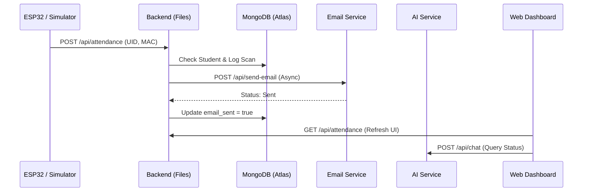

# Attendly: Smart Attendance System Overview

Attendly is a multi-service application designed for school attendance management. It integrates physical hardware (RFID/ESP32) with a modern web dashboard and AI-powered notification systems.

## 🏗️ System Architecture

The project is structured as a monorepo with four primary services:

### 1. **Client** (Frontend)
- **Path**: `file:///f:/Projects%20%28main%29/finalV/client`
- **Tech Stack**: React, Vite, Tailwind CSS, DaisyUI.
- **Purpose**: Provides a dashboard for teachers to manage students, view attendance logs, and interact with the AI assistant.
- **Key Files**:
  - [Students.jsx](file:///f:/Projects%20%28main%29/finalV/client/src/pages/Students.jsx): Student management UI.
  - [Attendance.jsx](file:///f:/Projects%20%28main%29/finalV/client/src/pages/Attendance.jsx): Real-time attendance logs.

### 2. **Files** (Main Backend)
- **Path**: `file:///f:/Projects%20%28main%29/finalV/files`
- **Tech Stack**: Node.js, Express, MongoDB (via Mongoose), SQLite.
- **Purpose**: The central API service. Manages the database, student records, and attendance logging.
- **Key Files**:
  - [server.js](file:///f:/Projects%20%28main%29/finalV/files/server.js): Entry point, DB connection, and static file serving.
  - [api.js](file:///f:/Projects%20%28main%29/finalV/files/src/routes/api.js): Defines API endpoints for students, attendance, and devices.
  - [attendanceController.js](file:///f:/Projects%20%28main%29/finalV/files/src/controllers/attendanceController.js): Logic for processing scans and triggering notifications.

### 3. **Email-Service** (Notification Microservice)
- **Path**: `file:///f:/Projects%20%28main%29/finalV/email-service`
- **Tech Stack**: Node.js, Express, Nodemailer.
- **Purpose**: Decouples the email notification logic from the main backend for better performance and local processing.
- **Key Files**:
  - [server.js](file:///f:/Projects%20%28main%29/finalV/email-service/server.js): Simple Express server for email tasks.

### 4. **AI-Service** (Intelligent Assistant)
- **Path**: `file:///f:/Projects%20%28main%29/finalV/ai-service`
- **Tech Stack**: Node.js, Express, Google Generative AI (Gemini), OpenAI SDK.
- **Purpose**: Processes natural language queries (e.g., "Is my child here?") and identifies actions like "Send bulk notice".
- **Key Files**:
  - [server.js](file:///f:/Projects%20%28main%29/finalV/ai-service/server.js): Contains the prompt engineering and AI provider logic.

---

## 🔄 Core Attendance Flow

## 🛠️ Development Setup

The project uses `concurrently` to run multiple services from the root:
- `npm run dev` (Root): Runs `client` and `files`.
- Individual services can be started via:
  - `client`: `npm run dev` (Port 5173)
  - `files`: `npm run dev` (Port 3001)
  - `email-service`: `nodemon server.js` (Port 5001)
  - `ai-service`: `nodemon server.js` (Port 5005)

## 📡 Key API Endpoints

| Category | Endpoint | Method | Description |
| :--- | :--- | :--- | :--- |
| **Students** | `/api/students` | GET | List all active students |
| **Attendance**| `/api/attendance`| POST | Log a scan (UID/MAC) |
| **Stats** | `/api/stats` | GET | Dashboard overview count |
| **AI** | `/api/chat` | POST | Interact with Attendly AI |

---

> [!NOTE]
> The system is currently configured to connect directly to **MongoDB Atlas**, with the local SQLite/Sync logic present but disabled in the main `server.js`.
